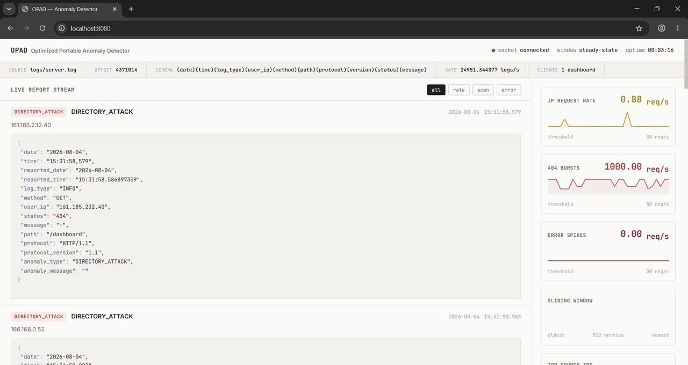

# OPAD
> **OPtimized Anomaly Detector**

A high-performance, real-time log anomaly detection platform featuring a C++ detection engine and a Python dashboard. OPAD tails server logs, detects suspicious activity using sliding-window analysis, and streams reports to a live web dashboard over a length-prefixed TCP socket.

## Demo

<p align="center">
  
</p>

## Features

- Real-time log monitoring
- High-performance C++23 detection engine
- Sliding-window anomaly detection
- Live, streaming HTML dashboard (Server-Sent Events, no manual refresh)
- Schema-driven RE2 log parser
- TCP streaming between detector and dashboard
- Automatic recovery from restarts
- Graceful shutdown on `SIGINT` / `SIGTERM`
- Live engine telemetry (uptime, byte offset, parse rate)

## What it detects

- **High request volume from a single IP** — flags IPs sending requests faster than a configurable threshold
- **Directory scanning / brute-force attacks** — detects bursts of 404 responses
- **Error rate spikes** — detects unusual bursts of `ERROR` log entries

## Architecture

```
Log File
    │
    ▼
 Reader
    │
    ▼
 Parser
    │
    ▼
 Detector
    │
    ▼
 Reporter
    │
    ▼
Socket Server
    │
 Length-Prefixed TCP
    │
    ▼
Socket Client
    │
    ▼
Report Builder
    │
    ▼
 Dashboard (SSE) ──▶ Browser
```

All of the above (reader, parser, detector, reporter, socket server) are owned and orchestrated by a top-level `Application` class that runs each stage on its own thread and coordinates clean shutdown.

## Components

### C++ Engine (`cpp/`)

#### `application`

Top-level orchestrator that wires together the reader, parser, detector, reporter, and socket server. It spins up three threads:

- **detection thread** — tails the log file, parses each line, feeds it to the detector, and pushes any resulting anomaly reports to the socket server
- **server thread** — serves connected dashboard clients
- **telemetry thread** — periodically broadcasts engine stats (uptime, current byte offset, parsing rate, per-category detection speed) to connected clients

`Application` also installs `SIGINT`/`SIGTERM` handlers so the engine (and all of its threads) shut down cleanly, flushing the reader offset before exiting.

#### `io_manager`

Continuously tails the log file while tracking its byte offset in `storage/.reader_offset`, allowing OPAD to resume processing after restarts without rereading previously processed logs.

#### `parser`

A schema-driven log parser built on **Google RE2**.

Instead of hardcoding field extraction, OPAD accepts a field schema such as

```
(date)(time)(log_type)(user_ip)(method)(path)(protocol)(version)(status)(message)
```

The schema is parsed once during construction into an ordered list of field names. During parsing, the parser dynamically constructs the RE2 capture arguments and performs a single `RE2::FullMatchN()` call to produce a field-name → value map.

Changing a log format only requires updating the schema instead of rewriting parsing logic.

#### `detector`

Maintains a fixed-size sliding window over recent log entries.

It tracks:

- request rate per IP
- 404 response frequency
- error-rate spikes

A function-pointer state machine

```
do_insert → process
```

is used to efficiently transition from the initial window-fill phase into steady-state processing.

#### `reporter`

Serializes detected anomalies into escaped JSON before transmission.

#### `socket_server`

Streams reports to connected clients using 4-byte length-prefixed TCP framing.

#### `utils`

Shared helpers used across the engine — timing utilities (`utils::now`, `utils::duration`), thread-sleep helpers, string/JSON stringification, and a `DEBUG_PRINT` macro for build-time-toggleable diagnostic logging.

---

### Python Dashboard (`dashboard/`)

The dashboard is split into a `backend/` (data ingestion + HTTP/SSE server) and a `frontend/` (the browser UI itself), with `templates/` holding the HTML fragments used to generate per-report pages and the "not found" page.

#### `backend/socket_client.py`

Maintains a persistent connection to the C++ engine, automatically reconnecting (with backoff) if the connection drops. Distinguishes engine telemetry payloads from anomaly reports and routes each accordingly.

#### `backend/report_builder.py`

Converts anomaly reports into standalone HTML report pages (`frontend/reports/report_<id>.html`) and appends a summary card to the dashboard home page, escaping all user-controlled data before rendering. Report IDs are persisted in `dashboard/storage/.report_id` so numbering survives restarts.

#### `backend/server.py`

Serves the dashboard through a lightweight threaded HTTP server (`ThreadingHTTPServer`) with:

- static asset serving for `frontend/scripts` and `frontend/styles`
- a `/events` **Server-Sent Events** endpoint that streams live anomaly reports and engine telemetry straight to the browser (with heartbeats to keep the connection alive)
- per-report page serving under `/report_*`
- path traversal protection for both static assets and generated reports

#### `frontend/`

A single-page dashboard (`index.html` + `scripts/script.js` + `styles/`) that:

- opens an `EventSource` connection to `/events` and updates live as new anomalies and telemetry arrive
- renders a live report stream with filter chips (`all` / `rate` / `scan` / `error`)
- draws live sparkline charts for IP request rate, 404 bursts, and error spikes
- shows connection status, uptime, current byte offset, and parse rate in a status bar

## Running OPAD

### Build and start the detector

```
mkdir build
cd build

cmake ../cpp
cmake --build . -t run
```

### Start the dashboard

```
cd dashboard
python3 main.py
```

Then open:

```
http://127.0.0.1:8080
```

The dashboard connects to the engine over TCP on port `5555` and streams live updates to the browser via `/events`.

## Testing

The `testbed/` directory contains a disposable HTTP server together with a traffic generator for exercising OPAD without requiring production traffic.

### Start the test server

```
cd testbed
python3 server.py
```

### Generate attack traffic

```
cd testbed
python3 attacker.py
```

Point the detector at the generated log file (typically `logs/server.log`) to observe anomalies being detected and streamed live to the dashboard.

## Security Notes

The test server intentionally trusts the client-supplied `X-Test-IP` header to simulate requests from different IP addresses.

This behavior exists **only** to simplify testing and must never be used in a production deployment.

## Design Notes

OPAD is a prototype focused on exploring high-performance streaming log analysis rather than being a production SIEM.

Notable implementation details include:

- Schema-driven parsing that separates log structure from parsing logic.
- Fixed-memory sliding-window analysis.
- Function-pointer state machine for efficient initialization.
- A dedicated `Application` layer that owns thread lifecycle and coordinates graceful shutdown on `SIGINT`/`SIGTERM`.
- Length-prefixed TCP protocol between the detection engine and dashboard.
- Server-Sent Events for pushing live updates to the browser without polling.
- JSON escaping in C++ and HTML escaping in Python to safely handle untrusted log data.
- Path validation to prevent directory traversal attacks.
- Resume support using persisted byte offsets (engine) and report IDs (dashboard) for uninterrupted operation after restarts.

## Tech Stack

- **C++23**
- **Python 3**
- **Google RE2**
- **CMake**
- **TCP Sockets**
- **Server-Sent Events (SSE)**
- **Sliding Window Algorithms**

---

**OPAD (OPtimized Anomaly Detector)** is a real-time log anomaly detection platform built to demonstrate efficient streaming analysis, modular architecture, and secure end-to-end report generation.
